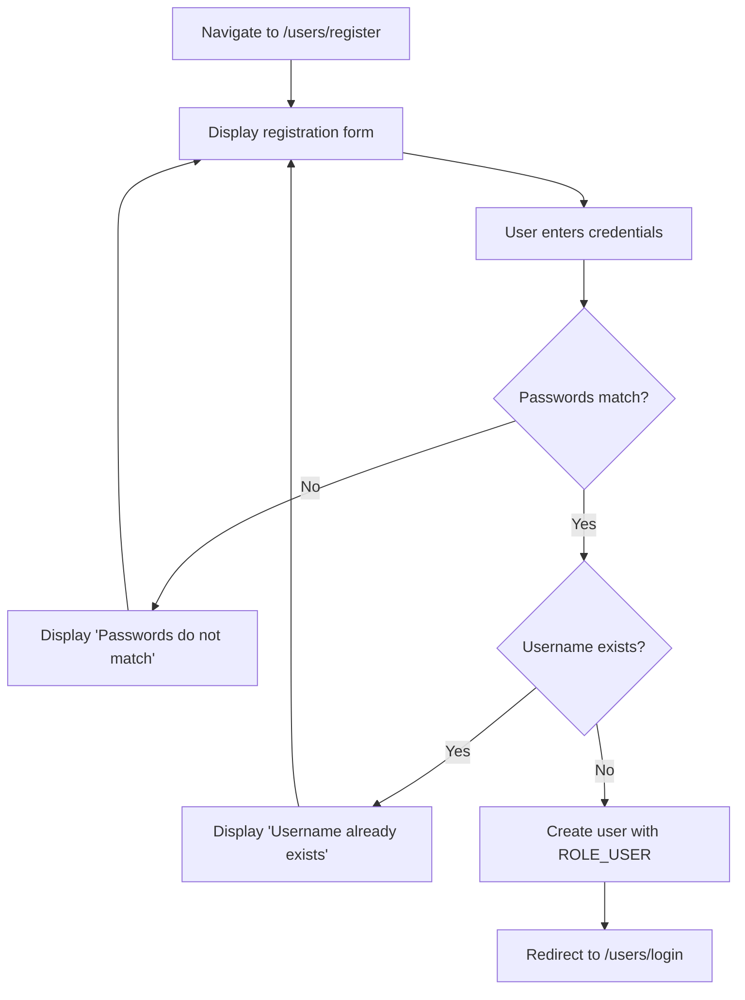
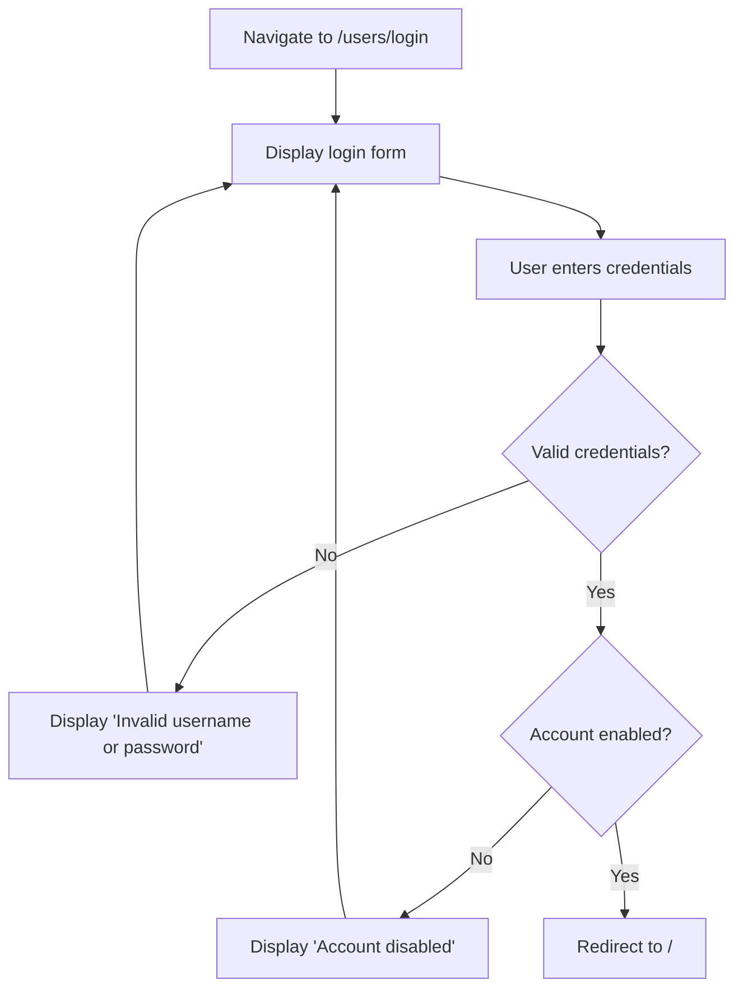
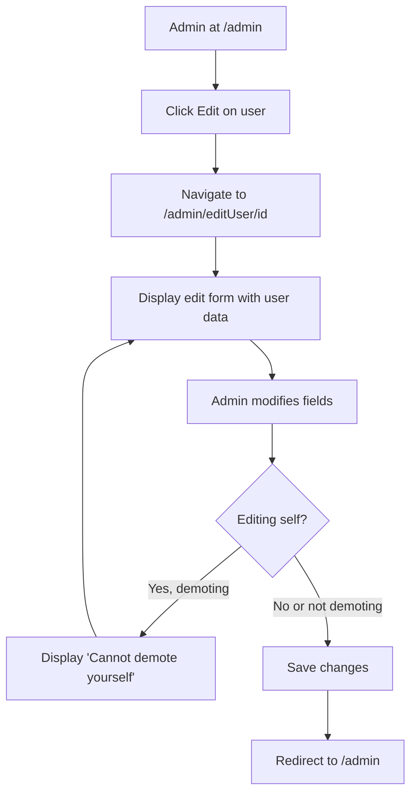
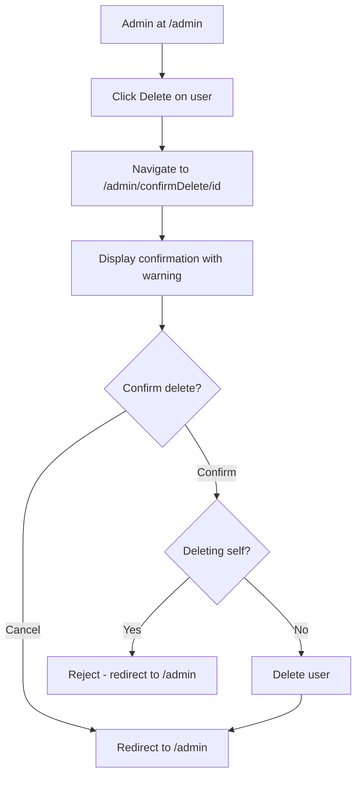

# User Feature Design Document

## Orders4U Application

---

|                |                              |
| -------------- | ---------------------------- |
| **Authors**    | Owen Lindsey & Brennan Bania |
| **Course**     | CST-323                      |
| **Instructor** | Professor Sluiter            |
| **Date**       | 23 January 2026              |


---

## Table of Contents

- [[#Feature Summary]]
- [[#User Roles]]
- [[#High-Level User Flows]]
- [[#Error Handling & Feedback]]
- [[#Navigation Behavior]]
- [[#Site Map]]
- [[#Form Field Specifications]]
- [[#Security Boundaries]]

<div style="page-break-after: always;"></div>

---

## Feature Summary

### What Problem Does This Feature Solve?

This feature provides secure user authentication and administrative user management for the Orders4U application. The system enables new users to register accounts, existing users to authenticate and access their data, and administrators to manage all user accounts within the system.

---

### Registration

New users create an account by providing a username and password with confirmation. The password confirmation field ensures accuracy during signup, preventing typographical errors that could lock users out of their accounts. All credentials are securely stored using BCrypt encryption, and duplicate usernames are rejected with a clear error message. Upon successful registration, users are automatically redirected to the login page to authenticate.

### Login / Logout

Existing users authenticate using their username and password credentials. When invalid credentials are submitted, the system displays an error message prompting the user to verify their information. Disabled accounts are prevented from logging in, ensuring administrators maintain control over access. Successful authentication redirects users to the home page, where they can access features based on their assigned role. Users can securely log out at any time to end their session, which redirects them back to the login page.

### Admin User Management

Administrators have access to a dedicated panel displaying all registered users in the system. From this panel, admins can edit user information including username, role assignment (Admin or User), account enabled status, and optionally reset passwords. User deletion requires confirmation through a dialog displaying a warning about the permanence of the action. As a safety feature, administrators cannot demote or delete their own accounts, preventing accidental lockout scenarios.

---

## User Roles

The application implements two distinct user roles with different permission levels:

### Regular User (`ROLE_USER`)

| Capability                        | Access |
| --------------------------------- | ------ |
| Register a new account            | ✓      |
| Log in and log out                | ✓      |
| Access home page                  | ✓      |
| View and manage orders            | ✓      |
| Access Admin Panel                | ✗      |

### Administrator (`ROLE_ADMIN`)

| Capability                        | Access |
| --------------------------------- | ------ |
| All Regular User capabilities     | ✓      |
| Access Admin Panel                | ✓      |
| View list of all users            | ✓      |
| Edit user details                 | ✓      |
| Change user roles                 | ✓      |
| Enable/disable user accounts      | ✓      |
| Delete user accounts              | ✓      |
| Demote/delete own account         | ✗      |

---

## High-Level User Flows

### Regular User Journey

The typical user flow begins at registration, proceeds through login, and lands on the home page where users can access the inventory management system to view and manage their orders.

```
Register → Login → Home Page → Manage Orders
```

### Admin User Journey

Administrators follow a similar authentication flow but gain access to the Admin Panel from the home page. From there, they can view the complete user list, select individual users to view details, and perform edit or delete operations as needed.

```
Login → Home Page → Admin Panel → View Users → Edit / Delete
```

---

<div style="page-break-after: always;"></div>

### Detailed Flow Diagrams

#### Registration Flow



<div style="page-break-after: always;"></div>

#### Login Flow



<div style="page-break-after: always;"></div>

#### Admin Edit User Flow



<div style="page-break-after: always;"></div>

#### Admin Delete User Flow



<div style="page-break-after: always;"></div>

---

## Error Handling & Feedback

Error messages are designed to be clear, actionable, and displayed in prominent locations to ensure users understand what went wrong and how to correct it.

### Registration Page Errors

| Error Condition              | Message Display                      | Location                    |
| ---------------------------- | ------------------------------------ | --------------------------- |
| Passwords do not match       | "Passwords do not match"             | Below form, prominently     |
| Username already exists      | "Username already exists"            | Below form, prominently     |
| Missing required fields      | HTML5 validation / inline errors     | Adjacent to field           |

### Login Page Errors

| Error Condition              | Message Display                      | Location                    |
| ---------------------------- | ------------------------------------ | --------------------------- |
| Invalid credentials          | "Invalid username or password"       | Above input fields          |
| Account disabled             | "Account is disabled"                | Above input fields          |

### Admin Page Feedback

| Action                       | Feedback                             |
| ---------------------------- | ------------------------------------ |
| User updated successfully    | Redirect to user list (implicit)     |
| User deleted successfully    | Redirect to user list (implicit)     |
| Cannot demote self           | "You cannot demote yourself"         |
| Cannot delete self           | Redirect without deletion            |

The delete confirmation dialog displays a prominent warning: **"WARNING: This action cannot be undone"** to ensure administrators understand the permanence of the deletion.

<div style="page-break-after: always;"></div>

---

## Navigation Behavior

### Conditional Navigation Display

The navigation bar dynamically adjusts its displayed items based on the user's authentication state and role. This ensures users only see options they have permission to access, reducing confusion and preventing unauthorized access attempts.

| User State                | Visible Navigation Items           |
| ------------------------- | ---------------------------------- |
| Not logged in             | Login, Register                    |
| Logged in (ROLE_USER)     | Home, Orders, Logout               |
| Logged in (ROLE_ADMIN)    | Home, Orders, User Admin, Logout   |

### Implementation

The navigation is implemented using the Thymeleaf Spring Security dialect. The `sec:authorize` attribute controls visibility based on authentication state: `!isAuthenticated()` displays login and register links to anonymous users, `isAuthenticated()` shows the logout option to authenticated users, and `hasRole('ADMIN')` reveals admin-specific links only to administrators.

Navigation must never display admin links to non-admin users, login or register links to authenticated users, or logout to non-authenticated users.

---

<div style="page-break-after: always;"></div>
## Site Map

### Visual Site Map

![[CST-323PairProgramming-Design.png]]

The site map illustrates the complete application flow. Authentication begins at either the Register or Login page, which are cross-linked for user convenience. After successful authentication, the system routes users based on their assigned role: regular users proceed to the Inventory page (`/orders`) while administrators are directed to the Admin Panel (`/admin`).

From the Admin Panel, administrators can view the complete user list displaying each user's avatar, username, role, and status. Selecting a user reveals detailed information with options to edit or delete. The Edit path leads to a form for modifying user details, while the Delete path presents a confirmation dialog with an explicit warning about the action's permanence.

### Route Diagram

```
┌───────────────────┐          ┌─────────────────┐
│  /users/register  │          │  /users/login   │
│   register.html   │◄────────►│   login.html    │
└────────┬──────────┘          └────────┬────────┘
         │     Post Registration        │ Post Login
         └──────────────┬───────────────┘
                        ▼
              ┌─────────────────┐
              │ Role-Based Route│
              └────────┬────────┘
                       │
         ┌─────────────┴─────────────┐
         │                           │
         ▼ ROLE_USER                 ▼ ROLE_ADMIN
┌─────────────────┐          ┌─────────────────┐
│    /orders      │          │     /admin      │
│ allOrders.html  │          │   admin.html    │
└────────┬────────┘          └────────┬────────┘
         │                            │
    ┌────┴────┐              ┌────────┴────────┐
    ▼         ▼              ▼                 ▼
┌────────┐ ┌────────┐  ┌───────────────┐ ┌──────────────────┐
│  New   │ │  Edit  │  │/admin/editUser│ │/admin/confirmDel │
│ Order  │ │ Order  │  │ editUser.html │ │confirmDelete.html│
└────────┘ └────────┘  └───────────────┘ └──────────────────┘
```

<div style="page-break-after: always;"></div>

---

## Form Field Specifications

### Registration Form (`/users/register`)

| Field            | Type     | Validation                        | Required |
| ---------------- | -------- | --------------------------------- | -------- |
| `username`       | text     | Unique, not empty                 | Yes      |
| `password`       | password | At least 8 characters + special   | Yes      |
| `confirmPassword`| password | Must match `password`             | Yes      |

### Login Form (`/users/login`)

| Field      | Type     | Validation   | Required |
| ---------- | -------- | ------------ | -------- |
| `username` | text     | Not empty    | Yes      |
| `password` | password | Not empty    | Yes      |

### Edit User Form (`/admin/editUser/{id}`)

| Field      | Type     | Validation                    | Required |
| ---------- | -------- | ----------------------------- | -------- |
| `id`       | hidden   | Valid user ID                 | Yes      |
| `username` | text     | Not empty                     | Yes      |
| `role`     | select   | User / Admin                  | Yes      |
| `enabled`  | checkbox | Account Enabled               | Yes      |
| `password` | password | Optional (only if changing)   | No       |

---

## Security Boundaries

The application enforces strict access control based on authentication state and user role. Public routes are accessible without authentication, while protected routes require valid credentials. Administrative functions are restricted to users with the ROLE_ADMIN designation.

| Route Pattern      | Access Level                  |
| ------------------ | ----------------------------- |
| `/users/login`     | Public (anonymous)            |
| `/users/register`  | Public (anonymous)            |
| `/`                | Authenticated                 |
| `/orders/**`       | Authenticated                 |
| `/admin/**`        | Authenticated + ROLE_ADMIN    |
